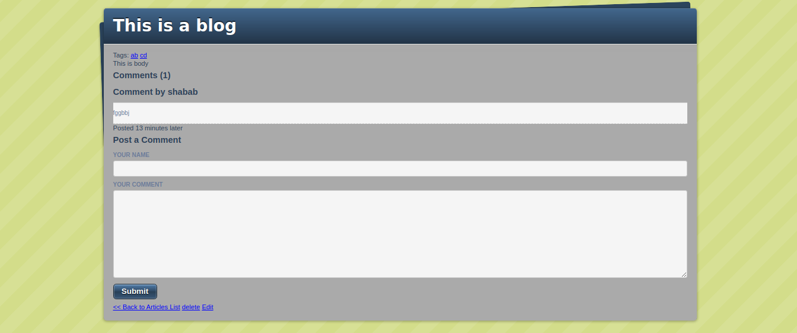

[](mailto:consult.ikraam@gmail.com) [](https://twitter.com/GhoorIkraam)

[](mailto:shababsaifi@gmail.com) [](https://twitter.com/shabab_ali)

# Micro Blogger App

> In this project, we have built a blog app using RubyOnRails MVC. A user make a blog post. Also user can attach pic and tags to the blog post.


## Built With

- Ruby 2.6.5 and Rails 5.2.4.2

## Live Demo

- Click [here](https://dry-beyond-15992.herokuapp.com/)

## Getting Started

To get a local copy up and running follow these steps:

### Prerequisites

- Ruby environment installed on local machine.
- Git

### Usage

- Fork/Clone this project to your local machine
- Open folder in your local enviroment and run thes lines of code to get started:

```Ruby
cd micro-reddit
bundle install
rails db:migrate
rails console
```

## Authors

👤 **Ikraam Ghoor**

- Github: [@ikraamg](https://github.com/ikraamg)
- Twitter: [@GhoorIkraam](https://twitter.com/GhoorIkraam)
- LinkedIn: [isghoor](https://linkedin.com/isghoor)
- Email: [consult.ikraam@gmail.com](mailto:consult.ikraam@gmail.com)

👤 **Shabab Ali**

- Github: [@alishabab](https://github.com/alishabab)
- Twitter: [@shabab_ali](https://twitter.com/shabab_ali)
- LinkedIn: [shababali](https://www.linkedin.com/in/shababali/)
- Email: [shababsaifi@gmail.com](mailto:shababsaifi@gmail.com)

## 🤝 Contributing

Contributions, issues and feature requests are welcome!

Feel free to check the [issues page](issues/)

Start by:

- Forking the project
- Cloning the project to your local machine
- `cd` into the project directory
- Run `git checkout -b your-branch-name`
- Make your contributions
- Push your branch up to your forked repository
- Open a Pull Request with a detailed description to the development(or master if not available) branch of the original project for a review

## Show your support

Give a ⭐️ if you like this project!

## Acknowledgments

- [JumstartLab](http://tutorials.jumpstartlab.com/projects/blogger.html).

## 📝 License

This project is [MIT](LICENSE.md) licensed
